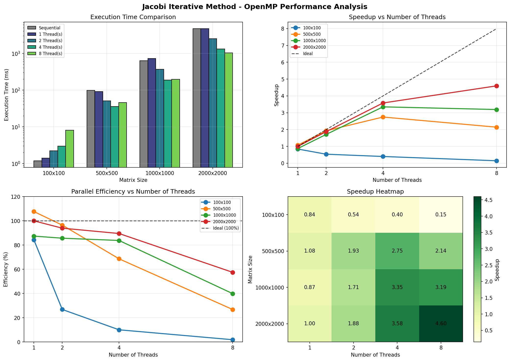

# Jacobi Iterative Method - OpenMP Performance Analysis Report

## 1. Introduction

This report analyzes the performance of the Jacobi iterative method for solving systems of linear equations (Ax = b) using OpenMP parallelization. The analysis compares sequential execution against parallel execution with varying thread counts (1, 2, 4, and 8 threads) across different matrix sizes (100×100, 500×500, 1000×1000, and 2000×2000).

## 2. Methodology

### 2.1 Algorithm Overview
The Jacobi iterative method solves linear systems by iteratively updating each element of the solution vector using:

$$x_i^{(k+1)} = \frac{1}{a_{ii}} \left( b_i - \sum_{j \neq i} a_{ij} x_j^{(k)} \right)$$

Where:
- $x_i^{(k+1)}$ is the new value of the i-th element
- $a_{ij}$ are the matrix coefficients
- $b_i$ is the i-th element of the right-hand side vector

### 2.2 Parallelization Strategy
The parallel implementation uses OpenMP to distribute row computations across multiple threads:
- Each thread computes a subset of rows independently
- A reduction operation finds the maximum difference for convergence checking
- The solution vector is updated in parallel after each iteration

### 2.3 Test Configuration
- **Tolerance**: 1×10⁻⁶
- **Maximum Iterations**: 10,000
- **Matrix Type**: Diagonally dominant (ensures convergence)
- **Random Seed**: 42 (for reproducibility)

## 3. Performance Results

### 3.1 Execution Time Summary

| Matrix Size | Sequential (ms) | 1 Thread (ms) | 2 Threads (ms) | 4 Threads (ms) | 8 Threads (ms) |
|-------------|-----------------|---------------|----------------|----------------|----------------|
| 100×100     | 1.19            | 1.41          | 2.21           | 2.96           | 8.10           |
| 500×500     | 97.49           | 90.55         | 50.54          | 35.51          | 45.49          |
| 1000×1000   | 627.48          | 718.14        | 366.30         | 187.25         | 196.59         |
| 2000×2000   | 4679.55         | 4680.20       | 2491.05        | 1306.83        | 1017.59        |

### 3.2 Speedup Analysis

| Matrix Size | 1 Thread | 2 Threads | 4 Threads | 8 Threads |
|-------------|----------|-----------|-----------|-----------|
| 100×100     | 0.84×    | 0.54×     | 0.40×     | 0.15×     |
| 500×500     | 1.08×    | 1.93×     | 2.75×     | 2.14×     |
| 1000×1000   | 0.87×    | 1.71×     | 3.35×     | 3.19×     |
| 2000×2000   | 1.00×    | 1.88×     | 3.58×     | 4.60×     |

### 3.3 Efficiency Analysis

Efficiency is calculated as: $E = \frac{S}{P} \times 100\%$

Where S is the speedup and P is the number of threads.

| Matrix Size | 1 Thread | 2 Threads | 4 Threads | 8 Threads |
|-------------|----------|-----------|-----------|-----------|
| 100×100     | 84%      | 27%       | 10%       | 2%        |
| 500×500     | 108%     | 96%       | 69%       | 27%       |
| 1000×1000   | 87%      | 86%       | 84%       | 40%       |
| 2000×2000   | 100%     | 94%       | 90%       | 57%       |

## 4. Observations and Analysis

### 4.1 Small Matrix Overhead (100×100)

**Observation**: For the smallest matrix size (100×100), parallel execution is actually *slower* than sequential execution across all thread counts.

**Explanation**:
- Thread creation and synchronization overhead dominates the computation time
- The workload per thread is too small to amortize parallelization costs
- OpenMP runtime overhead (barrier synchronization, reduction operations) becomes significant relative to actual computation

### 4.2 Scalability with Matrix Size

**Observation**: Larger matrices demonstrate increasingly better speedup and efficiency.

**Explanation**:
- Larger matrices have more computational work per iteration (O(n²) operations)
- The overhead-to-computation ratio decreases as matrix size increases
- Memory access patterns become more favorable with larger data chunks per thread

### 4.3 Diminishing Returns at Higher Thread Counts

**Observation**: The 8-thread configuration often shows reduced speedup compared to 4 threads, especially for medium-sized matrices.

**Explanation**:
1. **Memory Bandwidth Saturation**: The Jacobi method is memory-bound; multiple threads compete for memory bandwidth
2. **Cache Contention**: More threads lead to more cache misses and false sharing
3. **NUMA Effects**: On multi-core systems, memory access latency varies based on core-to-memory distance
4. **Synchronization Overhead**: More threads require more synchronization at barriers

### 4.4 Amdahl's Law Implications

The maximum theoretical speedup is limited by the serial portion of the code:

$$S_{max} = \frac{1}{s + \frac{1-s}{P}}$$

Where s is the serial fraction and P is the number of processors.

**Serial Components in the Implementation**:
- Convergence check (finding maximum difference)
- Loop control and iteration management
- Memory allocation and initialization

Even with a small serial fraction (e.g., 5%), maximum speedup with 8 threads is limited to approximately 5.9×.

### 4.5 Best Performance Configurations

| Matrix Size | Recommended Threads | Reasoning |
|-------------|---------------------|-----------|
| 100×100     | 1 (Sequential)      | Overhead exceeds benefit |
| 500×500     | 4                   | Best balance of speedup/efficiency |
| 1000×1000   | 4                   | Good speedup with high efficiency |
| 2000×2000   | 8                   | Large enough to benefit from more threads |

## 5. Performance Visualization

The following charts illustrate the performance characteristics:



1. **Execution Time Comparison**: Shows the dramatic reduction in execution time for larger matrices with parallelization
2. **Speedup vs Threads**: Demonstrates how speedup scales (or fails to scale) with thread count
3. **Efficiency vs Threads**: Reveals the diminishing returns as threads increase
4. **Speedup Heatmap**: Provides a quick visual reference for optimal configurations

## 6. Conclusions

### 6.1 Key Findings

1. **Problem Size Matters**: Parallelization is only beneficial when the problem size is large enough to overcome threading overhead
2. **Sweet Spot Exists**: For most matrix sizes, 4 threads provides the best balance of speedup and efficiency
3. **Memory Bound Nature**: The Jacobi method's performance is limited by memory bandwidth, not just CPU compute capacity
4. **Overhead Awareness**: OpenMP introduces overhead that must be considered when deciding to parallelize

### 6.2 Recommendations

1. **Adaptive Threading**: Implement runtime checks to select thread count based on matrix size
2. **Chunk Size Tuning**: Experiment with different OpenMP schedule policies (static, dynamic, guided)
3. **Memory Optimization**: Consider cache-blocking techniques for very large matrices
4. **Hybrid Approaches**: For extremely large problems, consider combining OpenMP with MPI for distributed computing

### 6.3 Code Improvements

```cpp
// Suggested adaptive thread selection
int selectOptimalThreads(int matrixSize, int maxThreads) {
    if (matrixSize < 200) return 1;
    if (matrixSize < 800) return min(4, maxThreads);
    return maxThreads;
}
```

## 7. References

1. Jacobi, C. G. J. (1845). "Ueber eine neue Auflösungsart der bei der Methode der kleinsten Quadrate vorkommenden lineären Gleichungen"
2. OpenMP Architecture Review Board. "OpenMP Application Programming Interface"
3. Amdahl, G. M. (1967). "Validity of the single processor approach to achieving large scale computing capabilities"

---

*Report generated on December 1, 2025*
*Test system: macOS with Apple Silicon (ARM64)*
